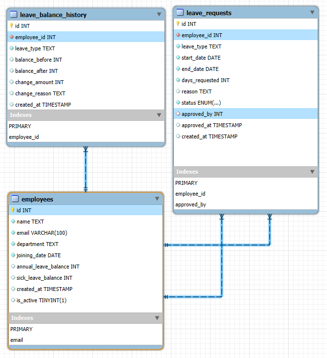

# Architecture & Scaling Design

### Architecture Overview

```
┌─────────────────────────────────────────────────────────────┐
│                    PRESENTATION LAYER                       │
├─────────────────────────────────────────────────────────────┤
│  Streamlit Frontend (app.py)                          │
│  • Dashboard & Analytics                                   │
│  • Employee Management                                     │
│  • Leave Application & Approval                           │
│  • Real-time Status Updates                               │
└─────────────────┬───────────────────────────────────────────┘
                  │ HTTP/REST API Calls
                  │
┌─────────────────▼───────────────────────────────────────────┐
│                   APPLICATION LAYER                        │
├─────────────────────────────────────────────────────────────┤
│  Flask REST API (main.py)                                  │
│  • Employee CRUD Operations                               │
│  • Leave Request Processing                               │
│  • Approval Workflow Management                           │
│  • Balance Calculations                                   │
│  • Business Logic Validation                             │
└─────────────────┬───────────────────────────────────────────┘
                  │ SQL Queries & Transactions
                  │
┌─────────────────▼───────────────────────────────────────────┐
│                    DATA ACCESS LAYER                       │
├─────────────────────────────────────────────────────────────┤
│  Database Models (models.py)                              │
│  • Employee Management                                    │
│  • Leave Request Processing                               │
│  • Balance Tracking                                       │
│  • Audit Trail Management                                │
└─────────────────┬───────────────────────────────────────────┘
                  │ Database Connections
                  │
┌─────────────────▼───────────────────────────────────────────┐
│                     DATA LAYER                             │
├─────────────────────────────────────────────────────────────┤
│  SQLite Database (data.db)                                │
│  • employees                                              │
│  • leave_requests                                         │
│  • leave_balance_history                                  │
└─────────────────────────────────────────────────────────────┘
```

### Database Schema Design



#### Tables Structure:

1. **employees**
   - id (PRIMARY KEY)
   - name (VARCHAR)
   - email (VARCHAR, UNIQUE)
   - department (VARCHAR)
   - joining_date (DATE)
   - created_at (TIMESTAMP)
   - updated_at (TIMESTAMP)

2. **leave_requests**
   - id (PRIMARY KEY)
   - employee_id (FOREIGN KEY)
   - leave_type (VARCHAR)
   - start_date (DATE)
   - end_date (DATE)
   - reason (TEXT)
   - status (VARCHAR)
   - approved_by (FOREIGN KEY)
   - created_at (TIMESTAMP)
   - updated_at (TIMESTAMP)

3. **leave_balance_history**
   - id (PRIMARY KEY)
   - employee_id (FOREIGN KEY)
   - leave_type (VARCHAR)
   - balance (FLOAT)
   - year (INTEGER)
   - created_at (TIMESTAMP)
   - updated_at (TIMESTAMP)

#### Relationships:
- employees (1) → leave_requests (M)
- employees (1) → leave_balance_history (M)
- employees (1) → leave_requests (M) [as approver]

### API Endpoints Design

#### Employee Management
- `GET /employees` - Retrieve all active employees
- `GET /employees/{id}` - Get specific employee details
- `POST /employees` - Add new employee
- `GET /employees/{id}/balance` - Get employee leave balance
- `GET /employees/{id}/leave-history` - Get employee leave history

#### Leave Request Management
- `GET /leave-requests` - Get all leave requests (with filters)
- `POST /leave-requests` - Submit new leave request
- `PUT /leave-requests/{id}/approve` - Approve leave request
- `PUT /leave-requests/{id}/reject` - Reject leave request

#### Dashboard & Analytics
- `GET /dashboard/stats` - Get dashboard statistics
- `GET /health` - API health check

### Scaling Strategy: 50 → 500 Employees

#### Current Architecture (50 employees)
- **Frontend**: Single Streamlit instance
- **Backend**: Single Flask server
- **Database**: SQLite file-based database
- **Deployment**: Single server setup

#### Scaled Architecture (500 employees)

```
                    ┌─────────────────┐
                    │   Load Balancer │
                    │    (Nginx)      │
                    └─────────┬───────┘
                              │
                 ┌────────────┼────────────┐
                 │            │            │
        ┌────────▼───┐ ┌──────▼───┐ ┌─────▼───┐
        │ Frontend 1 │ │Frontend 2│ │Frontend3│
        │(Streamlit) │ │(Streamlit)│ │(Streamlit)│
        └────────────┘ └──────────┘ └─────────┘
                 │            │            │
                 └────────────┼────────────┘
                              │
                    ┌─────────▼───────┐
                    │  API Gateway    │
                    │  (Flask-RESTX)  │
                    └─────────┬───────┘
                              │
                 ┌────────────┼────────────┐
                 │            │            │
        ┌────────▼───┐ ┌──────▼───┐ ┌─────▼───┐
        │API Server 1│ │API Server│ │API Server│
        │  (Flask)   │ │  (Flask) │ │ (Flask) │
        └────────────┘ └──────────┘ └─────────┘
                 │            │            │
                 └────────────┼────────────┘
                              │
                    ┌─────────▼───────┐
                    │   PostgreSQL    │
                    │   (Primary)     │
                    └─────────┬───────┘
                              │
                    ┌─────────▼───────┐
                    │   PostgreSQL    │
                    │   (Read Replica)│
                    └─────────────────┘
```

### Scaling Implementation Plan

#### Phase 1: Database Migration (100-200 employees)
```python
# Migration from SQLite to PostgreSQL
DATABASE_CONFIG = {
    'host': 'localhost',
    'port': 5432,
    'database': 'leave_management',
    'user': 'leave_user',
    'password': 'secure_password'
}

# Connection pooling for better performance
```

#### Phase 2: Horizontal Scaling (200-500 employees)
```python
# Redis for session management and caching
# Caching for frequently accessed data
```

#### Phase 3: Microservices Architecture (500+ employees)
```python
# Service separation
# 1. User Management Service
# 2. Leave Management Service  
# 3. Notification Service
# 4. Analytics Service
```

### Security Enhancements for Scale

#### Authentication & Authorization
```python
# JWT-based authentication
from flask_jwt_extended import JWTManager, create_access_token, jwt_required

app.config['JWT_SECRET_KEY'] = 'your-secret-key'
jwt = JWTManager(app)

@app.route('/auth/login', methods=['POST'])
def login():
    # Authentication logic
    access_token = create_access_token(identity=user_id)
    return {'access_token': access_token}

@app.route('/leave-requests', methods=['POST'])
@jwt_required()
def apply_leave():
    # Protected endpoint
    pass
```

#### Rate Limiting
```python
from flask_limiter import Limiter
from flask_limiter.util import get_remote_address

limiter = Limiter(
    app,
    key_func=get_remote_address,
    default_limits=["1000 per day", "100 per hour"]
)

@app.route('/leave-requests', methods=['POST'])
@limiter.limit("10 per minute")
def apply_leave():
    # Rate-limited endpoint
    pass
```

### Monitoring & Observability

#### Logging Strategy

### Cost Optimization

#### Resource Allocation (500 employees)
- **Database**: PostgreSQL (2 vCPU, 4GB RAM, 100GB SSD)
- **API Servers**: 3 instances (1 vCPU, 2GB RAM each)
- **Frontend**: 2 instances (1 vCPU, 1GB RAM each)
- **Cache**: Redis (1 vCPU, 1GB RAM)
- **Load Balancer**: Nginx (1 vCPU, 1GB RAM)

### Edge Cases Handled in Code

1. **Data Validation**:
   - Email format validation
   - Date range validation
   - Leave balance validation
   - Overlapping leave detection

2. **Business Logic**:
   - Weekend exclusion in working days calculation
   - Maximum consecutive leave days (30)
   - Leave before joining date prevention
   - Future leave application limits (1 year)

3. **System Resilience**:
   - Database connection error handling
   - API timeout handling
   - Graceful degradation
   - Transaction rollback on errors

4. **Security**:
   - SQL injection prevention (parameterized queries)
   - Input sanitization
   - Rate limiting
   - CORS configuration

5. **Performance**:
   - Connection pooling
   - Query optimization
   - Caching strategies
   - Pagination for large datasets